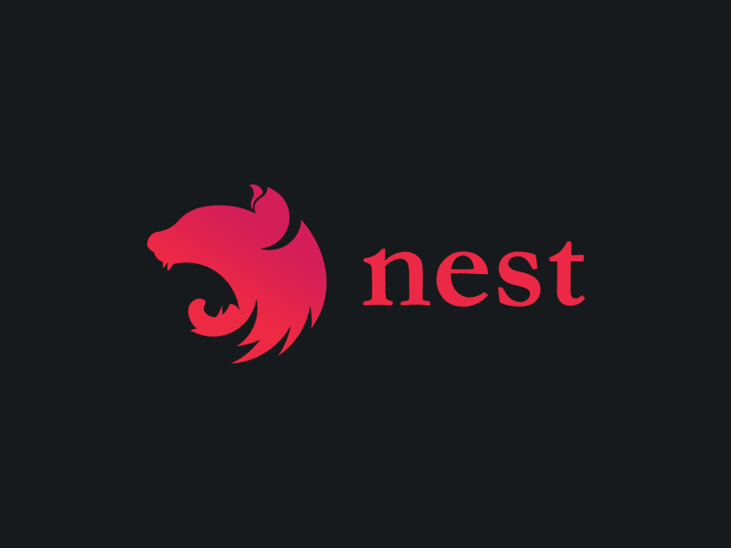

# NESTJS 




## TP N°1

### Intallation des déps

 - @nestjs/common
 - @nestjs/core
 - @nestjs/platform-express
 - reflect-metadata

### Création App Controller

Dans 1 fichier main.ts à la racien de _src_


```ts
import { Controller, Get, Module } from "@nestjs/common";
import { NestFactory } from "@nestjs/core";

@Controller()
class AppController {

    @Get()
    getRootRoute() {
        return 'Hi Ynov !'
    }

}


```

### Création App Module

```ts
@Module({
    controllers: [AppController]
})
class AppModule {

}
```

### Bootstrap 


```ts
async function bootstrap() {
    const app = await NestFactory.create(AppModule)

    await app.listen(3000)
}

bootstrap();

```

